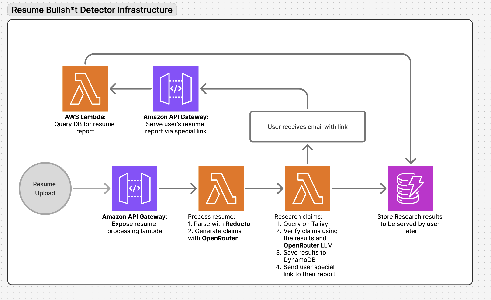

# Resume BS Detector 🔍

An AI-powered serverless application that fact-checks resume claims using web search and advanced language models. Built with AWS CDK, this system automatically verifies skills, achievements, and experiences listed on resumes.

<!--  -->
Architecture diagram coming soon...

## 🚀 Features

- **Automated Resume Processing**: Upload resumes via API and receive automated fact-checking
- **AI-Powered Claim Extraction**: Uses Gemini 3 Pro to identify verifiable claims from resumes
- **Web Search Verification**: Leverages Tavily API for deep web searches to verify claims
- **Smart Verification**: Categorizes claims as "Verified", "Unsure", or "Bullsh*t" based on search results
- **Email Notifications**: Sends results via email when processing completes
- **Serverless Architecture**: Fully serverless with AWS Lambda, DynamoDB, and S3
- **Rate-Limited Public API**: Throttled API Gateway to prevent abuse

## 🏗️ Architecture

The system consists of four Lambda functions orchestrated through API Gateway:

1. **SendResume Lambda** - API endpoint that receives resume uploads
2. **ProcessResume Lambda** - Extracts text from PDFs using Reducto AI and generates verification questions
3. **ResearchCandidateTavily Lambda** - Performs web searches and AI-powered verification for each claim
4. **FetchResults Lambda** - Retrieves verification results and original resume

## 🛠️ Tech Stack

- **Infrastructure**: AWS CDK (TypeScript)
- **Compute**: AWS Lambda (Node.js 24)
- **Storage**: S3, DynamoDB
- **API**: API Gateway with CORS
- **AI/ML**: 
  - OpenRouter (Gemini 3 Pro) for claim extraction and verification
  - Reducto AI for PDF parsing
  - Tavily for web search
- **Email**: Resend API

## 📋 Prerequisites

- Node.js 24 and npm
- AWS CLI configured with appropriate credentials
- AWS CDK CLI installed (`npm install -g aws-cdk`)
- API keys for:
  - OpenRouter
  - Reducto AI
  - Tavily
  - Resend

## 🚦 Getting Started

### 1. Clone and Install

```bash
git clone <repository-url>
cd skill-diff
npm install
```

### 2. Configure Environment Variables

Create a `.env` file in the project root:

```env
OPENROUTER_API_KEY=your_openrouter_key
REDUCTO_API_KEY=your_reducto_key
PIPELINE_ID=your_reducto_pipeline_id
TAVILY_API_KEY=your_tavily_key
RESEND_API_KEY=your_resend_key
DOMAIN=your_frontend_domain  # Note: Currently hardcoded in researchCandidateTavily Lambda
```

### 3. Deploy to AWS

```bash
# Build the project
npm run build

# Deploy the stack
npx cdk deploy
```

The deployment will output API Gateway URLs for submitting resumes and fetching results.

## 📡 API Usage

### Submit Resume

```bash
POST /prod
Content-Type: application/json

{
  "email": "user@example.com",
  "resumes": ["base64_encoded_pdf"]
}
```

### Fetch Results

```bash
GET /prod?id=<result_id>
```

Returns verification results and the original resume PDF.

## 🧪 Development

```bash
# Compile TypeScript
npm run build

# Watch mode
npm run watch

# Run tests
npm run test

# Synthesize CloudFormation template
npx cdk synth

# Compare deployed stack with current state
npx cdk diff
```

## 📦 Project Structure

```
├── bin/
│   └── skill-diff.ts          # CDK app entry point
├── lib/
│   └── skill-diff-stack.ts    # Infrastructure definition
├── lambda/
│   ├── sendResume/            # API endpoint for resume submission
│   ├── processResume/         # PDF processing and claim extraction
│   ├── researchCandidateTavily/ # Web search and verification
│   └── fetchResults/          # Results retrieval endpoint
├── public/
│   └── resume-bs-detector-aws-architecture.png
├── test/
│   └── skill-diff.test.ts     # Infrastructure tests
└── package.json
```

## ⚙️ Configuration

### DynamoDB

- **Table Name**: `research-candidate-tavily-db`
- **Partition Key**: `id` (String)
- **Provisioned Capacity**: 25 read/write units

### S3

- **Bucket Name**: `skill-diff-resume-s3-bucket`
- Stores original resume PDFs for retrieval

### API Gateway

- **Rate Limit**: 10 requests/second
- **Burst Limit**: 10 requests
- CORS enabled for all origins

### Lambda Timeouts

All Lambda functions are configured with 10-minute timeouts to accommodate:
- PDF processing
- Multiple web searches
- AI model inference

## 🔐 Security

- API keys stored as environment variables (not committed to version control)
- S3 bucket configured with appropriate IAM permissions
- Lambda functions follow principle of least privilege
- API Gateway rate limiting prevents abuse

## 🤝 Contributing

Contributions are welcome! Please feel free to submit a Pull Request.

## 📝 License

This project is open source and available under the MIT License.

## 🙏 Acknowledgments

- [Reducto AI](https://reducto.ai/) for PDF parsing
- [Tavily](https://tavily.com/) for web search API
- [OpenRouter](https://openrouter.ai/) for LLM access
- [Resend](https://resend.com/) for email delivery
